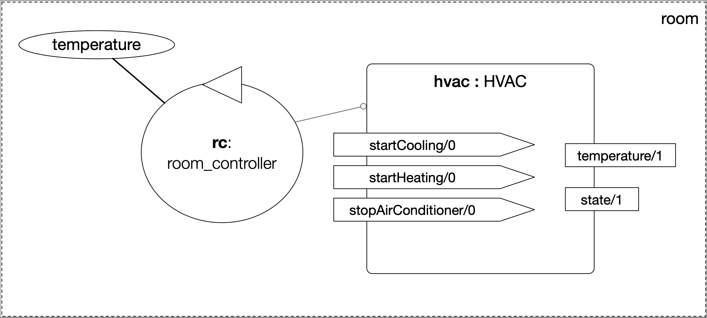
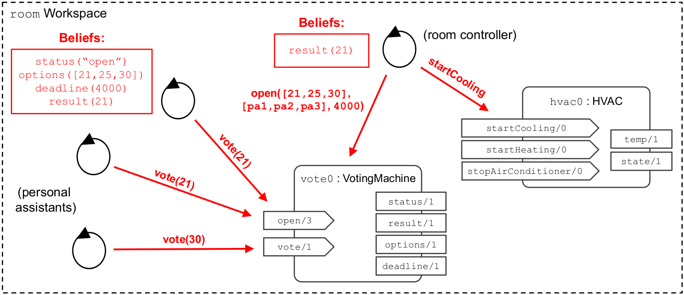
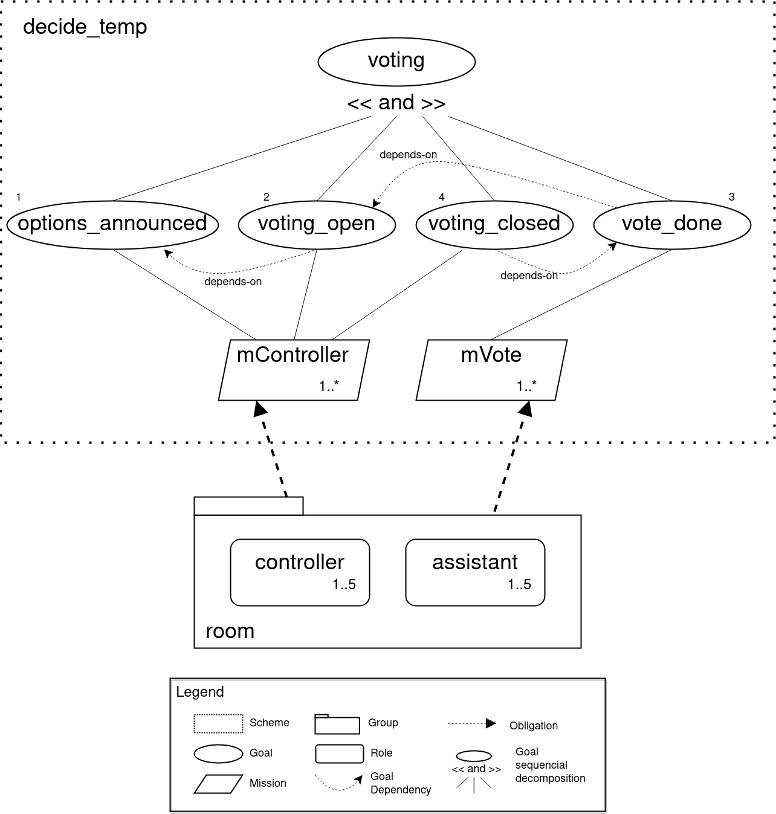

# Multi-Agent Oriented Programming Tutorial
:toc: right
:author: Maiquel de Brito
:date: July 2023
:source-highlighter: coderay
:coderay-linenums-mode: inline
:icons: font
:prewrap!:

This guide contains practical material for the tutorial _Multi-Agent Oriented Programming_ at https://sites.google.com/inf.ufpel.edu.br/wesaac2023[17th Workshop-School on Agents, Environments and Applications (WESAAC 2023)], 2023, Pelotas - Brazil.

This tutorial is adapted from the Multi-Agent Oriented Programming Tutorial given at EASSS 2023 by Andrei Ciortea, Jomi F. Hübner, and Luis Gustavo Nardin. Figures are taken/adapted from that tutorial and from the book _Multi-Agent Oriented Programming: Programming Multi-Agent Systems Using JaCaMo_ (O. Boissier, R. H. Bordini, J.F. Hubner, A. Ricci. The MIT Press, 2020).

==== Requirements
* Java JDK 17+
* Visual Studio Code

== Application scenario
In this tutorial, we will develop a MAOP where some agents that are _personal assistants_. They interact with each other and act in the environment.

== Agent Dimension Part I - Agent basics (Lab 1)

Scenario: 
In this lab, some _personal assistant_ agents have the simple task of to greet each other.

Objectives:

* Know the basic structure of JaCaMo applications;
* Run a multi-agent application;
* Understand the difference between agent implementation and agent instance;
* Have a first experience with the implementation of _goals_, _beliefs_, _plans_, and _internal actions_.   

=== Task 1: Run the first JaCaMo application

Clone the repository at (https://github.com/maiquelb/jacamo-wesaac2023). Open the folder link:hands-on/lab1[`hands-on/lab1`] with the Visual Studio Code (or access it in the terminal).  Then, run the project by typing the command below in the terminal:

----
jacamo agents_intro.jcm 
----

=== Task 2: Reading and understanding agent programs

* Exercise 1.2.1: open the JaCaMo application file (link:hands-on/lab1/agents_intro.jcm[`agents_intro.jcm`]) and the personal assistant agent code (file link:hands-on/lab1/src/agt/personal_assistant.asl[`src/agt/personal_assistant.asl`]). Read the files and identify the beliefs, goals, and plans. Try to map the program to the observed behavior. 

* Exercise 1.2.2: open the link:http://localhost:3272/[_mind inspector_] for the agents `bob` and `marie`. Compare the beliefs there with those identified in the program. Are they the same? Are they represented the same way? 

* Exercise 1.2.3: observe the plan in lines 13--14 of the personal assistant agent code (file link:hands-on/lab1/src/agt/personal_assistant.asl[`src/agt/personal_assistant.asl`]). What is the difference between this plan and the other ones?

* Exercise 1.2.4: type the command below, replacing `<agent_id>` by the identifier of an agent (either `bob` or `marie`). Observe the behaviour of the agent. Open the link:http://localhost:3272/[_mind inspector_]  and check whether the belief base of the agent has changed after running this command.

----
curl --request POST 'http://127.0.1.1:8080/agents/<agent_id>/command' --header 'Content-Type: application/x-www-form-urlencoded' --data-urlencode 'c=-+day_of_week(sunday)'
----

=== Task 3: Extending the agent program
* Exercise 1.3.1: make the agent `bob` to inform the current date using the plan `inform_date`. The other agents must not give this information.

* Exercise 1.3.2: add a new personal assistant agent to the system. This agent should greet in portuguese ("Bom dia.").

* Exercise 1.3.3: set the language of bob to japanese without adding any plan. Run the system and observe the output. Handle exceptions if needed.

==== Questons:
* Where to the beliefs come from?
* Where are the actions implemented?

== Agent Dimension Part II - Agent x Environment (Lab 2)

Objectives:

* Have a first experience with programming agents that perceive and act upon the environment (without to implement it);
* Understand the difference between _internal actions_ and _external actions_;
* Understand the difference between declarative and procedural goals;
* Understand more complex agent design patterns.

Scenario

Now, the _personal assistant_ controls the temperature of a room. It has the goal to mantain the temperature around a certain value.

The room is equipped with a "Heating, Ventilating and Air  Conditioning" (HVAC), that provides:

* the current room temperature;
* operations to start cooling, start heating, and stop the machine.

[[imgenvsmartroom]]
.smart room scenario

=== Task 1: Run the initial project for the smart room scenario

To run the smart room project, open the folder link:hands-on/lab2/smart-room[`hands-on/lab2/smart-room`] with the Visual Studio Code (or access it in the terminal).  Then, run the project by typing the command below in the terminal:
----
jacamo smart-room.jcm
----

You can see how the system reacts to changes in temperature by opening another terminal and executing the command:

----
curl -X POST  http://127.0.1.1:8080/workspaces/room/artifacts/hvac/properties/temperature -H 'Content-Type: application/json' -d '[ 10 ]'
----

replacing the last number 10 by the current temperature of the room.

=== Task 2: Reading and understanding agent programs

* Exercise 2.2.1: open the code of the _personal_assistant_ (file link:hands-on/lab2/smart-room/src/agt/personal_assistant.asl[`src/agt/personal_assistant.asl`]), read the code and identify the beliefs, goals, and plans. Try to map the program to the observed behavior. 

* Exercise 2.2.2: open the link:http://localhost:3272/[_mind inspector_] for agent `rc` and compare the beliefs there with those identified in the program. Are they the same? Are they represented the same way? Try to distinguish between beliefs supplied by the agent itself (i.e. mental notes) and those obtained by perception.

* Exercise 2.2.3: change the program so that the target temperature is 15.

=== Task 3: Improve the implementation

* Exercise 2.3.1: add a new plan to print the current state of the HVAC.

* Exercise 2.3.2: change the plans of the previous exercise so that when the hvac state is `"cooling"` it is printed "so cool" and, when the state is `"heating"` it is printed "so hot".

* Exercise 2.3.3: open the project in folder link:hands-on/lab2/e233[`lab2/e233`] and take a look at the personal assistant program. There is a difference in the plan in lines 16-18. Run the application and evaluate the problems of this implementation. Some ideas about how to fix?

* Exercise 2.3.4: open the project in folder link:hands-on/lab2/e234[`lab2/e234`] and take a look at the personal assistant program. The target temperature is as an argument of goal `keep_temperature`. The project, as it is, works. But what happens if a line like `!keep_temperature(35)` is added in the program? Explain the behavior produced by this change.

==== Questons:
* Is it possible to observe a different pattern between the plans to achieve `greet` and `keep_temperature`?
* Which actions of the agent are _internal actions_?
* Which actions of the agent are _external actions_?

== Agent Communication (Lab 3)

=== Task 1: Experiment different performatives

* Exercise 1: open the project `lab2/e1`, read the `.jcm` file and the program of the two agents, and execute the application. Now change the plan of Bob to:
+
----
+!start 
   <- .send(alice, tell, hello);
      .send(alice, tell, hello);
   .
----
+
run the project again and notice the difference. Now change the plan again to
+
----
+!start 
   <- .send(alice, signal, hello);
      .send(alice, signal, hello);
   .
----
+
run the project again and notice the difference. 

* Exercise 2: open the project `lab2/e2`, read the `.jcm` file and the program of the three agents, and execute the application. Use the mind inspector to see the beliefs of the agents (specially Alice). Now change the plan of Alice to:
+
----
+!start
   <- .wait(500);
      .send(karlos, askOne, vl(_), vl(X));
      .println(X).
----
+
run the project again and notice the difference. 

* Exercise 3: open the project `lab2/e3`, read the program of the three agents, and execute the application. List the sequence of exchanged messages and their performatives. Finally, use the mind inspector "link of plans" (in the bottom of the page) to see the plans of Alice.

=== Task 2: Improve the project for the voting protocol

You can run the project with the following commands:
----
cd lab2/smart-room-ma
./gradlew
----

* Exercise 4: change the list of options offered to the personal assistants. 

* Exercise 5: run the voting protocol twice, with two different options and notice possible problems.

* Exercise 6: currently, the `id` of the conversation is fixed to 1, this may cause problems when counting the votes. Change the program of the room controller so that the identification is an argument for the goal `voting`.

* Exercise 7: upgrade the previous version so that the conversation id value is incremented each time a voting protocol is executed.

* Exercise 8: add a new personal assistant. Does the application work properly? The rule `all_votes_received` is hard-coded for 3 participants. How to make it flexible? Think about possible solutions. Hints: see the internal actions link:https://jason.sourceforge.net/api/jason/stdlib/all_names.html[`.all_names`] and link:https://jason.sourceforge.net/api/jason/stdlib/df_register.html[`.df_register`].

== Environment Dimension (Lab 4)
Objectives:

* Exercise the basic skills to implement _artifacts_, which are the JaCaMo environment building blocks;
* Create and initialize _artifacts_;
* Create and update _observable properties_;
* Use _signals_;
* Implement _operations_.

Consider a new scenario where the _personal assistant_ cannot access the hvac. Such access is restricted to another agent called _room controller_. To keep the desirable temperature, the _personal assistant_ must ask the _room controller_ to manage the hvac. The _room controler_ then manages a voting to check the preference of all the _personal assistant_ and manages the hvac accordingly.

[[imgenv]]
.smart room scenario

//We will now implement the voting mechanism as an artifact: has no longer access to the hvac. 

//will use a _voting machine_ artifact to select the target temperature for the shared room based on their individual preferences.

//Most of the code required for this practical session is already provided in the link:lab3/smart-room-vm[lab3/smart-room-vm] project. The following tasks will guide you through adding the last lines of code that will bring everything together.

=== Task 1: Implement the usage interface for the voting machine

This lab uses the project at link:hands-on/lab4/smart-room-vm[`hands-on/lab4/smart-room-vm`]. The artifact template for our voting machine is defined in the link:hands-on/lab4/smart-room-vm/src/env/voting/VotingMachine.java[VotingMachine.java] class, but the usage interface is not yet fully implemented. Your first task is to complete this implementation. The following sub-tasks will guide you through it, note also the `TODO` items marked in comments in the Java class.

- Exercise 4.1.1: complete the artifact's `init` method by defining an observable property `voting_status` and setting its value to  `"closed"`.
- Exercise 4.1.2: complete the implementation of the `open` and `close` operations.

To solve these tasks, you will have to define and work with observable properties. Tips for a quick start:

- you can have a look at the implementation of the link:hands-on/lab4/smart-room-vm/src/env/devices/HVAC.java[HVAC artifact];
- you can check out https://cartago.sourceforge.net/?page_id=69[Example 01 — Artifact definition, creation, and use] from https://cartago.sourceforge.net/?page_id=47[CArtAgO by Examples].

=== Task 2: Instantiate the voting machine an make it available the agents

The implementation of the voting machine artifact is ready. Now, it is necessary to instantiate this artifact and make it available to the agents.

- Exercise 4.2.1: complete the `TODO` in link:hands-on/lab3/smart-room.jcm[smart-room.jcm] to create an instance of the voting machine called `vote`. 

- Exercise 4.2.2: run the application, go to link:http://localhost:3273[http://localhost:3273], check whether `room` workspace contains the voting artifct, and inspect its observable properties.

- Exercise 4.2.3: complete the `TODOs` in link:hands-on/lab3/smart-room.jcm[smart-room.jcm] to make all the agents to focus on the voting artifact.

- Exercise 4.2.4: run the application, go to link:http://localhost:3272[http://localhost:3272] and check whether the observable properties of the voting artifact are listed as beliefs of the agents.

=== Task 3: Use the voting machine

The voting machine is now ready — and the room controller agent is, in fact, already using it. Still, a few bits are missing:

- Exercise 4.3.1: Complete the `TODOs` defined in link:hands-on/lab4/smart-room-vm/src/agt/room_controller.asl[room_controller.asl] so that agent open a new voting when needed.

- Exercise 4.3.2: Complete the `TODOs` defined in link:hands-on/lab4/smart-room-vm/src/agt/personal_assistant.asl[personal_assistant.asl] so that agents use the voting machine and vote for their preferences.

- Exercise 4.3.3: Complete the `TODO` defined in link:hands-on/lab4/smart-room-vm/src/agt/personal_assistant.asl[personal_assistant.asl] so that agents shows the current temperature in its console message.

- Exercise 4.3.4: the _personal assistant_ keeps asking the _room controller_ to change the temperature while it does not matches the agent's preference. Change this behavior so that the _personal assistant_ adjusts its preference when it  perceives the voting result. The preference must increase by one if it is lower than the result. Similarly, it must must decrease by one if it is greater than the result.

=== Task 4: Implement a linked operation

The agents are happy with their brand new voting machine — and would like to showcase it to other agents via https://dweet.io/[Dweet.io]. Luckily, they already have a link:hands-on/lab4/smart-room-vm/src/env/social/DweetArtifact.java[DweetArtifact] artifact template that they can use for this purpose.

Your task is to complete the link:hands-on/lab4/smart-room-vm/src/agt/room_controller.asl[room_controller.asl] agent program with the following steps (see `TODOs`):

* Exercise 4.4.1: in link:hands-on/lab4/smart-room-vm/smart-room.jcm[smart-room.jcm], create an instance of a `DweetArtifact` called `deeet` in the `room` workspace. This artifact requires a string as creation parameter. Use `"jacamo-wesaac2023-<your name>"`.

* Exercise 4.4.2: link the voting machine to the newly created `DweetArtifact` using the operation `linkArtifacts(ArtId1, "port", ArtId2)`

** note 1: the voting machine artifact template already defines an output port named `publish-port`

** note 2: to inspect the information shared by the `dweet` artifact, use the following command: `curl  https://dweet.io:443/get/dweets/for/jacamo_wesaac23`

** note 2: further examples and documentation on linking artifacts, see https://cartago.sourceforge.net/?page_id=126[Example 08 — Linkability] from https://cartago.sourceforge.net/?page_id=47[CArtAgO by Examples]

** note 3: check out https://cartago.sourceforge.net/?page_id=47[CArtAgO by Examples] for a complete tour of all features supported for the enviornment dimension.

Note: To change the preference of the agents in running time, use the following command, replacing `<agent_id>` with the agent name and `<pref_temp>` with the preferred temperature.
----
curl --request POST 'http://127.0.1.1:8080/agents/<agent_id>/command' --header 'Content-Type: application/x-www-form-urlencoded' --data-urlencode 'c=-+preference(<pref_temp>)'
----

== Organisation Dimension (Lab 5)

=== Task 1: Reading and understanding an organization

[[imgorg]]
.organizational specification

* Exercise 5.1.1: open the project link:hands-on/lab5/smart-room-org[`hands-on/lab5/smart-room-org`]. Compare the organizational specification in link:hands-on/lab5/smart-room-org/src/org/smart_house.xml[`src/org/smart_house.xml`]
  with the <<imgorg>> shown above. Try to identify groups, roles, goals, missions, role cardinalities, and goal decompositions

* Exercise 5.1.2: there are some elements in the <<imgorg>> shown above that are not present in the the organizational specification in link:hands-on/lab5/smart-room-org/src/org/smart_house.xml[`src/org/smart_house.xml`]. Add these elements to the specification.

* Exercise 5.1.3: execute the application, link:http://localhost:3271[_organization inspector_] and observe the state of the organization.

* Exercise 5.1.4: execute the application, link:http://localhost:3272[_mind inspector_] and observe the beliefs of the agents.

* Exercise 5.1.4: compare the code of the link:hands-on/lab5/smart-room-org/src/agt/personal_assistant.asl[_personal assistant_] of this task with the link:hands-on/lab4/smart-room-vm/src/agt/personal_assistant.asl[one of the previous Lab4]. What are the differences? 

=== Task 2: Changing the organization

* Exercise 5.2.1: change the maximum number of `assistant` to 2. Execute the application. What is the outcome? 

* Exercise 5.2.2: change the order of `options_announced` and `voting_open` in the scheme `decide_temp`. What changes do you observe in the outcome?

* Exercise 5.2.3: parallelize the execution of the `announce_options` and `open_voting`. Analyze the result of the new scheme in the _organization inspector_.

* Exercise 5.2.4: execute the system and observe whether all the agents have voted. If that is not the case, modify the organizational specification so that every agent votes according to its preference.

* Exercise 5.2.5: extend the organizational specification so that the _controller_ is obliged to announce the result of the voting. Change also the _room controller_ code so that it fulfills this obligation.

=== Task 3: Agents deploying the organization

In the previous task, the organization is created by the application
designer using the jcm file. The agents then act within the
resulting organization entity. However, in some applications, the agents may need themselves to create or change the organization entity. In this task, the agents create new voting schemes whenever the temperature differs from their preferences.

* Exercise 5.3.1: open the project link:hands-on/lab5/smart-room-org-2[`hands-on/lab5/smart-room-org-2`]. Compare the link:hands-on/lab5/smart-room-org-2/smart-room.jcm[`smart-room.jcm`] with link:hands-on/lab5/smart-room-org/smart-room.jcm[the one of the previous task]. What is different?

* Exercise 5.3.2: complete the implementation of the link:hands-on/lab5/smart-room-org-2/src/agt/personal_assistant.asl[_personal assistant_] (line 30) to create a new voting schema.

* Exercise 5.3.3: complete the implementation of the link:hands-on/lab5/smart-room-org-2/src/agt/personal_assistant.asl[_personal assistant_] (line 32) make the existing group to manage the voting.

=== Task 4: Handling the state of the organization

* Exercise 5.4.1: in the project link:hands-on/lab5/smart-room-org[`hands-on/lab5/smart-room-org`], comment the line `{ include("$moiseJar/asl/org-obedient.asl") }` from the `room controller`. Run the application and observe the result. What has changed? To help you to answer this question, check out the code at link:https://github.com/moise-lang/moise/blob/master/src/main/resources/asl/org-obedient.asl[`https://github.com/moise-lang/moise/blob/master/src/main/resources/asl/org-obedient.asl`].

* Exercise 5.4.2: implement a plan in the `room_controller` agent that displays all fulfilled obligations. Hint: consider the organizational event `oblFulfilled/1`.
+
----
oblFulfilled(O) : Obligation O was fulfilled
----

* Exercise 5.4.3: implement a plan for the `personal_assistant` agents that reacts to the achievement of the organizational goal `closing_voting` by printing the current temperature. Hint: consider the organizational belief `goalState/5`.
+
----
goalState(S, G, LC, LA, T) : Goal G, of scheme S, is in state T (possible values for T are waiting, enabled, and satisfied); LC is the list of agents committed to the goal, and LA is the list of agents that have already achieved the goal.
----

* Exercise 5.4.4: open the project in the folder link:hands-on/lab5/smart-room-org-3[`hands-on/lab5/smart-room-org-3`]. This project includes a small change that delays the process of committing with missions. This highlights the fact that 
the agents who are _obliged_ to vote are the only ones who effectively vote. Agents that are _permitted_ to vote do not vote. This can be observed by checking both the agents' outputs in the MAS console and the normative state of the organization in the link:http://localhost:3271/smart_house_org/norm/r1.temp_r1[_organization inspector_]. Change the implementation so that the agents _permitted_ to vote also engage in the voting process. Hints: (i) consider the organizational belief `permission(A,R,G,D)` (the agent A is permitted to achieve the goal G with the deadline D because the reason R); (ii) use as inspiration the plans to handle obligations available at link:https://github.com/moise-lang/moise/blob/master/src/main/resources/asl/org-obedient.asl[`https://github.com/moise-lang/moise/blob/master/src/main/resources/asl/org-obedient.asl`].

=== Task 5: Adding institutions

* Exercise 5.5.1: open the project link:hands-on/lab5/smart-room-org[`hands-on/lab5/smart-room-org`]. In the code of the link:hands-on/lab5/smart-room-org/src/agt/personal_assistant.asl[`personal assistant`], remove the latest line of the plan `+!vote_done`. Run the application and compare the achieved temperature with the votes of the agents. Check what might be wrong.

* Exercise 5.5.2: open the project link:hands-on/lab5/smart-room-inst[`hands-on/lab5/smart-room-inst`]. Compare the organization entity definition at link:hands-on/lab5/smart-room-inst/smart-room.jcm[`smart-room.jcm`] with link:hands-on/lab5/smart-room-org/smart-room.jcm[the one of the previous task]. What is different?

* Exercise 5.5.3: in the current version of the link:hands-on/lab5/smart-room-inst[smart-room-inst] application, the goal of ending the voting is never achieved even the responsible agent executes the corresponding operation in the voting artifact. Add a new constitutive rule in link:hands-on/lab5/smart-room-inst/src/org/smart_house.sai[`src/org/smart_house.sai`] to specify that the execution of the _close_ operation in the _voting artifact_ counts as the the achievement of the _voting_closed_ goal. Use the following template, replacing the elements in `<>` by the proper identifiers.
+
----
11: count-as done(<scheme>,<goal>,Agent)
    when <artifact operation name> [sai__agent(Agent)].    
----
